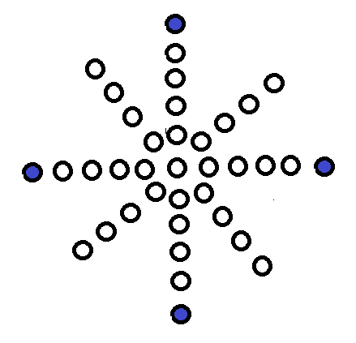

# LED Matrix Pattern Effects using FastLED

This project uses the [FastLED](https://github.com/FastLED/FastLED) library to create stunning visual effects on a 50-pixel LED matrix. Designed for microcontrollers such as the ATmega328 (Arduino Nano/Uno), it supports two data lines for mirrored effects and includes watchdog recovery.

---

## ✨ Features

- **Multiple LED patterns**: Collapse, Expand, Zig-Zag, Rotating, Diagonal Sweep, etc.
- **Watchdog Timer (WDT)** integration for fault recovery.
- **Dual Data Line Output**: Supports simultaneous control via two data pins.
- **Custom Layout Mapping** to suit your LED arrangement.

---

## 🧱 LED Layout

The layout is a star-like radial pattern, not a linear strip. It includes a central LED and 8 arms radiating outward. Each arm contains multiple LEDs, with the outermost LEDs on the four cardinal directions marked in blue to indicate corners.

